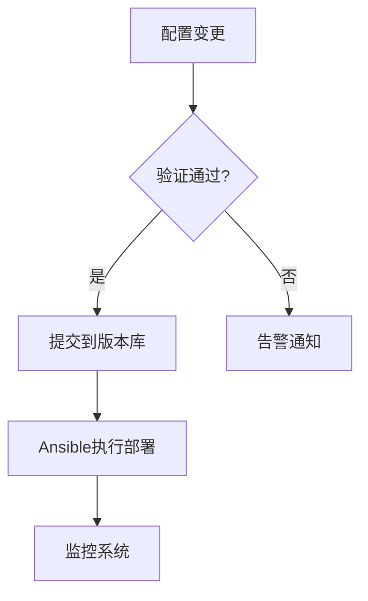

# OpenResty 负载均衡迁移与管理平�?
## 项目概述
本项目旨在用 OpenResty 集群替代 F5 负载均衡设备，解决动�?VIP 配置、健康检查扩展、多实例管理等核心问题，并提供统一的管理平台�?
## 核心需求清�?
### 1. 动�?VIP 管理
- 实现 VIP 池的拆分策略
- 每个 VIP 对应独立 OpenResty 实例
- 支持 API 动态配置更新（避免全量 reload�?- 基于 etcd �?Consul 实现配置同步

### 2. 健康检查扩�?- 基于 OpenResty �?Lua 脚本实现�?  - 自定义检查协议支�?  - 动态检查频率调�?  - 复合检查条件（多指标联合判断）
  - 检查结果可视化

### 3. 实例管理规范
- 命名规则�?  - 格式：`环境_业务模块_序列号_端口`（示例：prd_payment_001_8080�?  - 唯一性约束：实例名全局唯一
- 生命周期管理�?  - 创建时自动生成服务单元文件（systemd�?  - 删除时自动清理残留进�?
mermaid
graph TD
A[实例标识] --> B{命名规则}
B --> C[环境类型_prd/dev]
B --> D[业务模块_支付/订单]
B --> E[序列号_001]
B --> F[端口号_8080]


### 4. 配置管理规范
- 安装路径：`/opt/openresty/{实例名}_{端口}`
- 配置文件结构�?  ```
  ├── nginx.conf
  ├── streams.d/      # TCP/UDP 配置
  ├── http.d/         # HTTP 配置 
  ├── lua/            # 自定义脚�?  └── certs/          # 证书文件
  ```

### 5. 管理平台功能矩阵

| 模块        | 功能�?                    | 实现方式                  |
|-------------|---------------------------|-------------------------|
| 节点管理    | 批量部署/卸载             | Ansible Playbook        |
| 实例管理    | 启动/停止/状态查�?       | systemctl 命令封装      |
| 配置管理    | 版本回溯/差异对比         |  配置文件数据库存�?  |
| 监控告警    | 实时指标可视�?           | Prometheus + Grafana    |
| 配置管理    | 灰度发布、集群管�?        | 流量切分+配置热加�?     
| 监控告警    | 阈值告�?                 | Alertmanager 集成

### 6. 自动化部�?- Ansible 角色结构�?
    bash
    roles/
    ├── openresty
    �?├── tasks/
    �?�?├── install.yml
    �?�?└── configure.yml
    �?└── templates/
    �?└── nginx.conf.j2

### 7. 监控体系
- 采集指标�?  - 连接�?请求�?  - 健康检查失败次�?  - Lua VM 使用情况
  - 证书过期预警

### 8. 架构设计

mermaid
flowchart TB
subgraph 管理平台
A[Web UI] --> B[API Server]
B --> C[(MySQL)]
end
subgraph 数据中心
C --> D[Agent]
D --> E[OpenResty 01]
D --> F[OpenResty 02]
end
E --> G[(Prometheus)]
F --> G
G --> H[Grafana]

### 9. 数据库设�?sql:readme.md
-- 实例�?CREATE TABLE instances (
id VARCHAR(36) PRIMARY KEY, -- 实例唯一标识
name VARCHAR(64) UNIQUE, -- 实例名称 web-payment_001_8080
install_path VARCHAR(255), -- 安装路径
status ENUM('running', 'stopped', 'error'),
last_modified TIMESTAMP
);
-- 配置版本�?CREATE TABLE config_versions (
version_id INT AUTO_INCREMENT PRIMARY KEY,
instance_id VARCHAR(36),
config_hash CHAR(64),
backup_path VARCHAR(255),
FOREIGN KEY (instance_id) REFERENCES instances(id)
);

### 10. Roadmap
1. 第一阶段�?周）：基础实例管理 + 配置备份
2. 第二阶段�?周）：动态配置更�?+ 健康检查扩�?3. 第三阶段�?周）：监控系统集�?4. 第四阶段�?周）：容器化支持

## 项目结构说明

```text
/allinai/infra/ansible/
�?├── playbooks/                  # 存放Ansible执行剧本
�?  └── deploy_openresty_cluster.yaml  # 主部署剧本：协调角色执行顺序
�?      # 指定目标主机组、变量文件引用、角色调用逻辑
�?├── roles/                      # 角色功能模块目录
�?  └── openresty/              # OpenResty专属角色
�?      ├── tasks/              # 任务定义目录
�?      �?  ├── main.yml        # 任务入口：编排验证、安装、配置等子任�?�?      �?  ├── validate.yml    # 验证任务：检查实例命名规范等约束条件
�?      �?  ├── install.yml     # 安装任务：处理依赖安装、编译部署等操作
�?      �?  └── configure.yml   # 配置任务：同步配置文件和模板
�?      �?�?      ├── templates/          # 配置模板目录（Jinja2格式�?�?      �?  ├── cluster_config.yaml.j2  # 集群配置模板：动态生成实例配�?�?      �?  └── nginx.conf.j2   # Nginx基础配置模板：包含安�?性能优化参数
�?      �?�?      └── files/             # 静态文件目�?�?          └── install_openresty_multi.sh  # 安装脚本：多实例编译安装工具
�?              # 功能：自动下载源码、编译安装、生成服务文件、配置权�?�?├── inventory/                  # 环境配置目录
�?  └── production/            # 生产环境配置
�?      ├── hosts               # 主机清单文件（可自动生成�?�?          # 格式：[组名]\n主机�?ansible_host=IP
�?      └── group_vars/         # 组变量目�?�?          └── openresty.yaml  # OpenResty全局变量
�?              # 定义：版本号、安装路径、实例列表、编译参数等
�?└── scripts/                    # 辅助脚本目录
    └── generate_inventory.py   # 动态主机清单生成器
        # 功能：根据实例配置自动生成主机清单，实现实例与主机的动态映�?```

## 关键文件说明

### 1. 主部署剧�?(`playbooks/deploy_openresty_cluster.yaml`)
```yaml
---
# 部署目标：openresty_servers 主机�?# 执行流程：加载变�?-> 执行角色任务
- name: 部署 OpenResty 集群
  hosts: openresty_servers
  become: yes  # 提权执行
  vars_files:
    - ../inventory/production/group_vars/openresty.yaml

  tasks:
    - name: 包含角色任务
      include_role:
        name: openresty  # 调用 openresty 角色
```

### 2. 动态清单生成脚�?(`scripts/generate_inventory.py`)
```python
#!/usr/bin/env python3
"""
功能：根据实例配置动态生成主机清�?逻辑�?  1. 读取组变量中的实例配�?  2. 根据端口号生成模拟IP（示例：端口8080 -> 192.168.1.80�?  3. 生成标准Ansible主机清单格式
"""


## 维护说明

